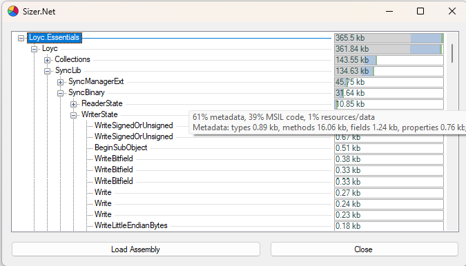

# Sizer.Net
This is a tool that shows the size of things (types, methods, static arrays, etc.) in a .NET assembly.



## Download

You can find a binary download under the [Releases page](https://github.com/schellingb/sizer-net/releases/latest).

## Additions in qwertie's fork (by Fable5)

- Size breakdown by category in the size bars and in tooltip on those bars:
  - **MSIL code** (blue) — the actual byte instructions of methods
  - **Metadata** (gray) — type/field/method table overhead, name strings and custom attributes
  - **Resources / data** (green) — static field data, arrays and embedded resources
  - Plus a second tooltip line that breaks the metadata down by kind: types, methods, fields, properties, events, custom attributes and other.
- Automatic dependency resolution: When an assembly references a dependency that can't be found, the tool now probes the standard .NET locations for it before asking you — the global assembly cache, .NET Framework install and reference-assembly directories (including Facades), the .NET Core/5+ shared frameworks and the NuGet package cache. Candidates are verified by reading their assembly metadata, preferring exact version and public-key-token matches. Runtime assemblies that forward types to `System.Private.CoreLib` are rejected so they don't cause every type to fail loading; the file dialog only appears if no suitable candidate is found.
- Explanation of unresolved types: if some types still can't be evaluated, a dialog lists every failed type by name together with the loader's reason for each one, and offers tailored advice — for example, where to find a missing dependency, or a suggestion to analyze a .NET Framework/Standard build when the failures are caused by types that only exist on the .NET Core runtime (such as `Span<T>` and `Memory<T>`).
- Copy to clipboard: right-click any tree node to copy its subtree to the clipboard as tab-indented text:

```
SelectedItem: 2.88 kb (30% metadata)
	SubItem1: 1.4 kb
	SubItem2: 1.1 kb
```

## Usage

On launch it shows a file selection dialog with which you can load any kind of .NET assembly (exe or dll).  
Once loaded, it shows the things stored in the assembly in a tree view with the accumulated size on the right.  
The usual structure is:  
[assembly name] → [namespace] → [class] → [thing]

## Command line

If launched via command line, it takes a path to an exe or dll file as the first argument.

## Accuracy

The tool is **not fully accurate** as it uses the simple approach of inspection via .NET's built-in reflection.  
While the size of actual byte instructions of functions is correct, overhead from types, fields, etc. is estimated.

A more accurate method would be to use a custom .NET metadata reader library like dnlib that could read byte-accurate information.

## Unlicense

Sizer.Net is available under the [Unlicense](http://unlicense.org/).
